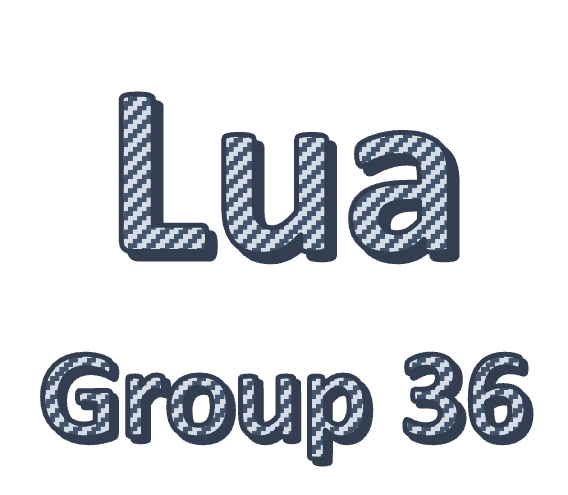

<h3 align="center">
  
      

  <a href="README.md">Overview</a>     |     <a href="INSTALL.md">Installation</a>    |       <a href="docs/hw2345.md">Objectives</a>    
  
   [](https://doi.org/10.5281/zenodo.7033333)
[](https://codecov.io/gh/J-Sumer/CSC510) [](https://opensource.org/licenses/MIT)
  
</h3>

Group 36s Lua conversion project aims to allow you maximum flexibility when reading and computing tabular data from a csv. Tired of using blackbox packages? Wanting more control over efficiency and functionality? Then Group 36's Lua is for you! 


## Capabilities 


## Use 


## Homework Deliverables 
### HW1

* Initial folder structure and files for CSC 510 : HW1
* Github actions

### HW2
To run :

```
cd /path/repo
python -m test.test # tested with python3.8
```
Warning:
There shouldn't be any other package named `code` in `env:PYTHONPATH`; conflicts with vs-code package

### HW3
To run :

```
cd /path/repo
python -m test.test # tested with python3.8
or
python -m code.lua -e ALL
```
Check [actions/runs/](https://github.com/nakraft/CSC510/actions) for docker build and test status.

Warning:
There shouldn't be any other package named `code` in `env:PYTHONPATH`; conflicts with vs-code package

### HW4 

* Code documentation 
* Increasing code coverage 
